<div align="center">



<a href="https://suyash-chaudhari.web.app"></a>
<a href="https://linkedin.com/in/suyash-makrand-chaudhari-23768b316"></a>
<a href="mailto:csuyash2506@gmail.com"></a>


</div>

<br/>

## `❯ ls ~/stack`

```bash
drwxr-xr-x  cloud/     aws  gcp  firebase  docker  kubernetes  terraform  github-actions  linux
drwxr-xr-x  web/       typescript  react  next.js  node  express  tailwind  mongodb  postgres
drwxr-xr-x  web3/      solidity  ethers  ipfs  smart-contracts
drwxr-xr-x  design/    figma  photoshop  illustrator  ui/ux  branding
```

<p align="center">
  <br/>
  <br/>
  
</p>

## `❯ ./stats --live`

<p align="center">
  
  
  
</p>

<sub>⚙️ cards are rendered by my own GitHub Action (`scripts/gen_cards.py`) every day — no third-party APIs, no rate limits.</sub>

## `❯ ls ~/projects --featured`

| | project | what it does | stack |
|---|---|---|---|
| ⚖️ | **[clauselens](https://github.com/Suyash2527/clauselens)** · [live ↗](https://clauselens-320835628255.asia-south1.run.app/) | Clause-by-clause, plain-language breakdown of legal agreements — scored from *your* side of the deal | `Gemini` `Cloud Run` `TypeScript` |
| 🛕 | **[Discover Nashik](https://github.com/Suyash2527/Discover_Nashik)** · [live ↗](https://discovernashik.vercel.app) | Offline-first PWA for Kumbh Mela pilgrims — maps, emergency access, voice assistant in Marathi / Hindi / English | `PWA` `TypeScript` `Vercel` |
| 🤖 | **[TRIForge Interview Agent](https://github.com/Suyash2527/TRIForge-Interview-Agent)** · [live ↗](https://triforge-interview-agent.vercel.app) | Autonomous AI interviewer that adapts questions to candidate performance and outputs structured evaluations | `Agents` `RAG` `TypeScript` |
| 🏟️ | **[StadiumAI](https://github.com/Suyash2527/StadiumAI)** | AI matchday companion for the FIFA World Cup 2026 with a Soft-UI design | `Next.js` `GenAI` |
| 🏥 | **[Arogya Setu Dashboard](https://github.com/Suyash2527/Arogya_Setu_Dashboard)** | National health command center — hospital telemetry, Gemini triage, ambulance load-balancing | `React` `Gemini` `Maps API` |
| 🌱 | **[EcoTrace](https://github.com/Suyash2527/EcoTrace)** | AI-powered carbon-footprint tracker for individuals and families | `TypeScript` `AI` |
| 🔐 | **Decentralized KYC Vault** | Blockchain-backed eKYC — verify once, share securely everywhere <sub>(private · pitch stage)</sub> | `Solidity` `Node` `React` |

## `❯ tail -f ~/journey.log`

```log
[2026-09] ✔ SPEAKER     "Build With AI" — KBT College of Engineering, Nashik
[2026-09] ✔ ORGANISER   GDG on Campus MET BKC  ·  hosting Hacktoberfest 2026 🎃
[2026]    ✔ OPEN SOURCE GSSoC 2026 contributor — global rank #332
[2026]    ✔ HACKATHONS  Smart India Hackathon · MIT India Hackathon · MindCraft 2K26 · PromptWars
[done]    ✔ CERTIFIED   AWS Certified Cloud Practitioner
[now]     ⟳ LOADING     AWS Solutions Architect – Associate ▓▓▓▓▓▓▓░░░
[always]  ♥ COMMUNITY   Core Team · GDG Nashik
```

## `❯ git log --oneline -6 --all-repos`

<!--START_SECTION:activity-->
1. 🎉 Merged PR [#1](https://github.com/Suyash2527/Discover_Nashik/pull/1) in [Suyash2527/Discover_Nashik](https://github.com/Suyash2527/Discover_Nashik)
2. 💪 Opened PR [#1](https://github.com/Suyash2527/Discover_Nashik/pull/1) in [Suyash2527/Discover_Nashik](https://github.com/Suyash2527/Discover_Nashik)
<!--END_SECTION:activity-->

## `❯ snake --eat contributions`

<p align="center">
  <picture>
    <source media="(prefers-color-scheme: dark)" srcset="https://raw.githubusercontent.com/Suyash2527/Suyash2527/output/github-snake-dark.svg" />
    <source media="(prefers-color-scheme: light)" srcset="https://raw.githubusercontent.com/Suyash2527/Suyash2527/output/github-snake.svg" />
    
  </picture>
</p>

## `❯ ssh collab@suyash`

```console
Connection established ✔
> open to: cloud/devops internships · hackathon teams · open-source collabs · design gigs
> reach me: csuyash2506@gmail.com
> response time: < 24h
```

<p align="center"><sub><code>suyash@cloud:~$ exit</code> — thanks for stopping by ⚡</sub></p>
